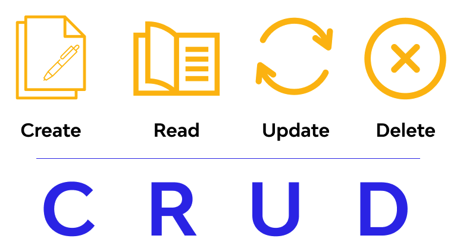

 

Best place to learn different programming   languages through <strong>crud</strong> operations

 

    <a href="#sponsors-"><strong>Sponsors</strong></a> ·
    <a href="#preface"><strong>Preface</strong></a> ·
    <a href="#features"><strong>Features</strong></a> ·
    <a href="#install"><strong>Install</strong></a> ·
    <a href="#quick-guide"><strong>Quick Guide</strong></a> 

 

     
    
    
    
    

# CRUD of the Century

Biggest collection of easiest **crud** applications created   using different programming languages & frameworks.   Go to the guide: [CRUD: Install](#install)

Learn different programming languages & frameworks   through crud (create, read, update, delete) operatioins.

**This is the ultimate output of my interest in learning   various programming languages over the years.   Hope this will be helpful for everyone**

We're in progress to cover - 

    
    
    
    
    
    
    
    
    
    
    

And many more...

### Sponsors 🚀
#### Be a hero, [sponsor](https://github.com/Meraj-Kazi/crud-of-the-century/blob/main/SUPPORT.md) the project, please!

### Preface 

Hello there!
Are you willing learn a programming language that you know nothing about?

Sit tight with me. You'll see how much easy and effective it is to learn a completely new programming language or framework through crud operation without any prior knowledge. But please keep in mind, you'll have to go through each and every line of the documents I provide to understand the concepts clearly. I have carefully wrote down the docs so that it can be understood by school kids. That means it becomes easy to understand for anyone of any age. **DO NOT SKIP ANYTHING**.

#### In case you don't know what CRUD actually is - 

## Despite being commonly pronounced /krʌd/, CRUD is not a word. It’s an abbreviation that stands for Create, Read, Update, and Delete or Destroy. 

#### What is CRUD?

CRUD refers to the four basic operations a software application should be able to perform – Create, Read, Update, and Delete.

In such apps, users must be able to **create data**, have access to the data in the UI by **reading** the data, **update** or edit the data, and **delete** the data.

In full-fledged applications, CRUD apps consist of 3 parts: an API (or server), a database, and a user interface (UI).

The API contains the code and methods, the database stores and helps the user retrieve the information, while the user interface helps users interact with the app.

You can make a CRUD app with any of the programming languages out there. And the app doesn’t have to be full stack – you can make a CRUD app with client-side JavaScript.

Each letter in the CRUD acronym has a corresponding HTTP request method.

|  CRUD Operation  |  HTTP request method  |
| :------------------------ | :-------------: | 
|  Create  |  POST  |
|  Read  |  GET  |
|  Update  |  PUT or PATCH  |
|  Delete  |  DELETE  |

  

***This data is heavily inspired from the one published on FreeCodeCamp. You can [read](https://www.freecodecamp.org/news/crud-operations-explained/) their's as well.***

### Features 

"CRUD of the Century", which means This project, has the **biggest** collection of easiest crud projects in several programming languages & frameworks. All the codes are up-to-date with their latest coding system. Our goal is to cover all the modern programming langiages & frameworks in this, so that, developers can get help.

Here's the list of current available crud operations -

- [x] [NodeJS CRUD](https://github.com/Meraj-Kazi/crud-of-the-century/tree/nodejs)
- [ ] [Angular CRUD](#) *coming soon* 
- [ ] [Django CRUD](#) *coming soon* 
- [ ] [JavaScript CRUD](#) *coming soon*
- [ ] [Java CRUD](#) *coming soon* 
- [ ] [NestJS CRUD](#) *coming soon* 
- [ ] [NextJS CRUD](#) *coming soon* 
- [ ] [Laravel CRUD](#) *coming soon* 
- [ ] [Php CRUD](#) *coming soon* 
- [ ] [Python CRUD](#) *coming soon* 
- [ ] [React CRUD](#) *coming soon* 
- [ ] [Svelte CRUD](#) *coming soon* 
- [ ] [TypeScript CRUD](#) *coming soon* 
- [ ] [VueJS CRUD](#) *coming soon* 

### Install 

Installation process is very simple and different for each languages & frameworks. Each one is properly documented in their corresponding branches. For example, if you wanna learn about the installation process of NodeJS to run [NodeJS CRUD](https://github.com/Meraj-Kazi/crud-of-the-century/tree/nodejs), you'll find it inside the [NodeJS CRUD](https://github.com/Meraj-Kazi/crud-of-the-century/tree/nodejs) branch doc.

### Quick Guide 

The intention of this project is to create a global factory of crud projects containing all the programming languages and frameworks available. Also maintain & update them with latest coding structures.

Just go to any branch. They are well documented, easily explained, ready to run from anywhere within minutes.  

Any student, fresher, professional programmer/developer/engineer can get help from this right away.

Each of the branches of this repo contains CRUD project in different programming languages & frameworks. You'll find the related guides in each one. It's **super easy** to learn and I documented them as if anyone with some basic coding knowledge could understand. 

Learning crud operation is the first big challenge of learning any programming language/framework or development. It doesn't matter if it's web programming or anything else, learning crud is a must. Also it gives you proper basic knowledge about the system.

### Support 

This is an MIT-licensed open source project. It can grow thanks to the sponsors and support by the amazing backers. If you'd like to join them, please [read more here](https://github.com/Meraj-Kazi/crud-of-the-century/blob/main/SUPPORT.md).

### People 

- Maintainers - [Meraj](https://twitter.com/meraj_kazi)
- Contributors - [Meraj](https://twitter.com/meraj_kazi)
- Website - [crud of the century](https://meraj-kazi.github.io/crud-of-the-century)

### License 

CRUD of the Century project is [MIT licensed](https://github.com/Meraj-Kazi/crud-of-the-century/blob/main/LICENSE).